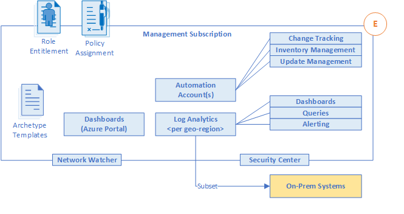

## Navigation Menu
* [Overview](../README.md)
* [North Star Architecture](./NorthStar-Architecture.md)
    -	[Design Principles](./Design-Principles.md)
* [Design Guidelines](./Design-Guidelines.md)
    -	[A - Enterprise Enrolment and Azure AD Tenants](./A-Enterprise-Enrolment-and-Azure-AD-Tenants.md)
    -	[B - Identity and Access Management](./B-Identity-and-Access-Management.md)
    -	[C - Management Group and Subscription Organisation](./C-Management-Group-and-Subscription-Organisation.md)
    -	[D - Network Topology and Connectivity](./D-Network-Topology-and-Connectivity.md)
    -	**E - Management and Monitoring**
    -	[F - Business Continuity and Disaster Recovery](./F-Business-Continuity-and-Disaster-Recovery.md)
    -	[G - Security, Governance and Compliance](./G-Security-Governance-and-Compliance.md)
    -	[H - Platform Automation and DevOps](./H-Platform-Automation-and-DevOps.md)
* [Implementation Guide](./Implementation-Guide.md)
---

# E. Management and Monitoring

Figure 9 – Platform Management and Monitoring

## 1. Planning for Platform Management and Monitoring

This section will focus on centralized management and monitoring at a platform level, exploring how an entire enterprise Azure estate can be operationally maintained. More specifically, it will consider the key recommendations to support central teams ability to maintain operational visibility of a large-scale Azure platform.

***Design Considerations***

-   A Log Analytics workspace is an administrative boundary.

-   App Centric Platform monitoring, encompassing both hot and cold telemetry paths for metrics and logs respectively

    -   OS metrics (e.g. perf counters, custom metrics)

    -   OS logs (e.g. IIS, ETW, Syslogs)

    -   Resource Health envents

-   Security audit logging and achieving a horizontal security lens across the entire customer Azure estate.

    -   Potential integration with on-premises SIEM systems such as Service Now or ArcSight.

    -   Azure Activity Logs

    -   AAD audit reports

    -   Azure Diagnostic Service; Diagnostic Logs and metrics, KV audit events, NSG flow and event logs

    -   Azure Monitor, Network Watcher, Security Center, and Azure Sentinel

-   Azure data retention thresholds and requirements for archiving.

    -   The default retention period for Log Analytics is 30 days, with a maximum of 2 years.

    -   The default retention period for AAD reports (premium) is 30 days.

    -   The default retention period for the Azure Diagnostic service is 90 days.

-   Operational requirements

    -   Operational dashboarding using native tools, such as Log Analytics, or 3^rd^ party tooling.

    -   Controlling privileged activities with centralized roles.

    -   MSI for access to Azure services; support for Azure Automation is a Scandium deliverable

    -   Resource Locks to protect both the deletion and edit of resources.

***Design Recommendations***

-   Use a single Log Analytics workspace for centralised platform management except where RBAC and data sovereignty requirements mandate the consideration of separate workspaces.

-   Export logs to Azure Storage if log retention requirements exceed 2 years.

    -   Leverage immutable storage with WORM policy (Write Once, Read Many) to make data non-erasable and non-modifiable for a user-specified interval.

-   Use Azure Policy for access control and compliance reporting.

-   Monitor in-guest VM configuration drift using Azure Policy.

-   Use the Update Management Solution as a long-term patching mechanism, for both Windows and Linux VMs.

-   Use Azure Network Watcher to proactively monitor traffic flows via NSG Flow Logs v2.

-   Use resource locks to prevent accidental deletion of critical shared services.

-   Use deny policies to supplement AAD RBAC assignments.

-   Include Service/Resource Health events as part of the overall platform monitoring solution.

<!-- -->

-   Do not send raw logs entries back to on premise monitoring systems, but instead adopt the principal of “data born in Azure, stays in Azure”.

    -   If on-premise SIEM integration is required send critical alerts instead or logs.

## 2. Planning for Application Management and Monitoring

Expanding on the previous section, this next section will now consider the federated management and monitoring of customer application workloads, touching on how application teams can operationally maintain their application workloads.

***Design Considerations***

-   Application monitoring can utilize the centralized Log Analytics workspace or use dedicated workspaces.

-   Application performance and health monitoring for both IaaS and PaaS resources.

-   Data aggregation across all application components.

-   Health modelling and operationalization of

    -   How to measure the health of the workload and its subsystems; “traffic light” model for health representation.

    -   How to respond to failures across application components.

***Design Recommendations***

-   Use an application specific Log Analytics workspace to collect logs and metrics from IaaS and PaaS application resources.

-   Establish separate hot and cold paths for metrics and logs.

-   Use shared storage accounts within the “Landing Zone” for Azure Diagnostic Extension log storage when required.

-   Leverage Azure Monitor with Event Grid, or Azure Alerts, for the generation of operational alerts.
